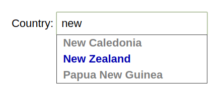

# 0g-typeahead
A lean typeahead library. Single file. Less then 400 lines of code.

It is a continuation of <a href="https://github.com/twbs/bootstrap/commits/501aabf5723584eb0d1fba9569226f1b726a51b3/js/bootstrap-typeahead.js">bootstrap-typeahead.js</a> by Twitter.

Currently it needs jQuery. This dependency should be removed at some point.

## Implementation:

```html
 Country: <input name=country type=text>

 <script>
  $('input[name=country]').typeahead({source:  keyPress});

  function keyPress(query,process)
  {
   process(['Andorra','Argentina','Australia',...]);
  } 
 </script>
```

## Result:



[Try the demo](https://no-gravity.github.io/0g-typeahead/demo.html)
